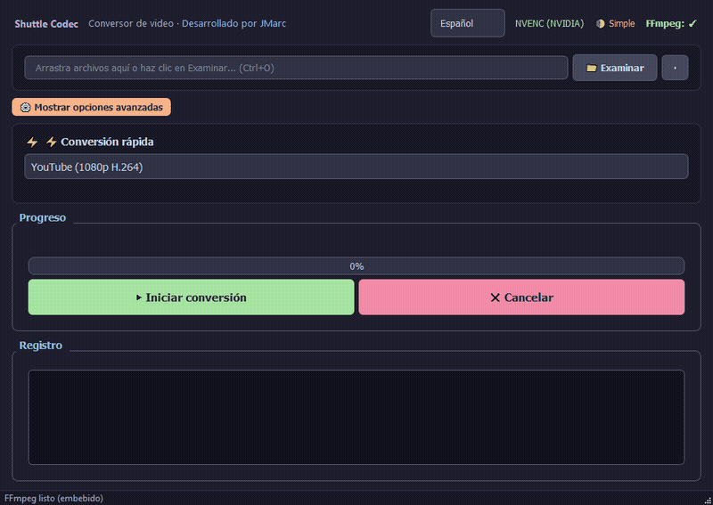

# Shuttle Codec

**Una GUI moderna, elegante y potente para FFmpeg** — Convierte videos sin escribir un solo comando.

<p align="center">
  
</p>

<p align="center">
  <a href="https://github.com/jmarc9901/shuttle-codec/blob/main/LICENSE">
    
  </a>
  <a href="https://www.python.org/downloads/">
    
  </a>
  <a href="https://github.com/jmarc9901/shuttle-codec/actions">
    
  </a>
  <a href="https://github.com/jmarc9901/shuttle-codec">
    
  </a>
  <a href="https://github.com/jmarc9901/shuttle-codec/releases">
    
  </a>
  <a href="https://github.com/jmarc9901/shuttle-codec/blob/main/CONTRIBUTING.md">
    
  </a>
</p>

<p align="center">
  <a href="README.md">🇬🇧 English</a>
</p>

> Convierte cualquier archivo de video con solo arrastrar y soltar. Soporta lote, aceleracion por hardware NVENC, recorte de video, conversion a GIF y modo experto. Tema oscuro estilo Catppuccin Mocha. Interfaz responsive adaptable a cualquier tamano de pantalla.

---

## Demo

<p align="center">
  
</p>

---

## Caracteristicas principales

### Faciles de usar
- **Modo Simple/Experto**: Por defecto modo simple (solo formato), toggle para opciones avanzadas
- **Arrastra y suelta**: Soporta multiples archivos a la vez
- **Atajos de teclado**: Ctrl+O (abrir), Ctrl+E (convertir), Ctrl+Q (salir), Delete (quitar)
- **Deteccion automatica**: Al cargar un video analiza codec, resolucion y sugiere la configuracion optima
- **Panel de informacion**: Codecs, resolucion, tamano y duracion visibles siempre al cargar un archivo
- **Responsive**: La interfaz se adapta a cualquier tamano de ventana con scroll automatico
- **🌐 Internacionalizacion**: Interfaz en Español e Ingles, seleccionable desde la cabecera

### Potentes
- **Conversion de video**: MP4 (H.264/H.265), MKV, AVI, MOV, WebM, **GIF**
- **Conversion de audio**: MP3, AAC, WAV, FLAC, OGG, M4A, WMA
- **Procesamiento por lotes**: Convierte multiples archivos con la misma configuracion
- **Conversion a GIF**: Genera GIFs optimizados con palette optimizada (palettegen + paletteuse)
- **Recorte de video**: Selecciona inicio y fin para recortar segmentos especificos (duracion en tiempo real)
- **Aceleracion por hardware**: Detecta automaticamente NVENC (NVIDIA), AMF (AMD) o QSV (Intel)
- **Control fino**: CRF, preset de codificacion, resolucion, FPS, codec de audio y mas

### Informativas
- **ETA y velocidad**: Tiempo restante estimado y velocidad durante la conversion
- **Info del archivo**: Codecs, resolucion, bitrate, duracion al cargar
- **Persistencia**: Recuerda tamano/posicion de ventana, idioma y ultimas configuraciones
- **Log detallado**: Registro completo de todas las operaciones

---

## Tecnologias

| Capa | Tecnologia |
|------|-----------|
| Lenguaje | Python 3.11+ |
| GUI | PyQt5 |
| Motor de video | FFmpeg (embebido) |
| Empaquetado | PyInstaller |
| Tema | Catppuccin Mocha |
| Testing | pytest + unittest.mock |

---

## Inicio rapido

### Opcion 1: Descargar (Recomendado)
1. Ve a la [ultima version](https://github.com/jmarc9901/shuttle-codec/releases/latest)
2. Descarga `shuttle-codec.exe`
3. Ejecutalo — FFmpeg ya viene incluido

### Opcion 2: Desde codigo fuente

```bash
# Clonar repositorio
git clone https://github.com/jmarc9901/shuttle-codec.git
cd shuttle-codec

# Instalar dependencias
pip install -r requirements.txt

# Descargar FFmpeg (solo primera vez)
python download_ffmpeg.py

# Ejecutar
python -m src.main
```

### Compilar ejecutable

```bash
python download_ffmpeg.py
pip install pyinstaller
python build.py
```

El ejecutable estara en `dist/shuttle-codec.exe`.

---

## Mejoras recientes (v1.1.0)

### 🔒 Seguridad
- SSL verification activada en descarga de FFmpeg (eliminado `CERT_NONE`)
- Validacion de rutas con `os.path.realpath()` para evitar path traversal
- Validacion de archivos multimedia (tamano, existencia, tipo) antes de procesar
- Manejo seguro de subprocesos con timeouts

### 🎯 Tipado y calidad
- Type hints en absolutamente todas las funciones y metodos
- Hinting de tipos de retorno y parametros en toda la codebase
- Reorganizacion de imports y eliminacion de imports no utilizados

### 🌐 Internacionalizacion
- Sistema completo de traducciones (i18n) con soporte Español/Ingles
- 100+ strings traducidas en ambos idiomas
- Selector de idioma en la cabecera de la aplicacion
- Persistencia del idioma seleccionado entre sesiones

### 🧪 Testing
- Suite de 37 tests unitarios que cubren:
  - `ffmpeg_handler.py`: 22 tests (comandos, formatos, hardware, resolucion de rutas)
  - `ffmpeg_downloader.py`: 8 tests (busqueda de binarios, bundled vs system)
  - `i18n.py`: 7 tests (traducciones, cambios de idioma, keys faltantes)
- Tests ejecutables con `python -m pytest tests/`

### 💡 UX/UI
- Tooltips descriptivos en todos los controles
- Validacion de archivos con mensajes de error claros
- Estados vacios correctamente manejados
- Selector de idioma directamente en la cabecera

---

## Ejecutar tests

```bash
pip install pytest
python -m pytest tests/ -v
```

---

## Estructura del proyecto

```
shuttle-codec/
├── src/
│   ├── __init__.py
│   ├── main.py              # Punto de entrada
│   ├── app.py               # UI principal (PyQt5)
│   ├── ffmpeg_handler.py     # Logica FFmpeg/FFprobe
│   ├── ffmpeg_downloader.py  # Localizacion de binarios
│   └── i18n.py              # Traducciones ES/EN
├── tests/
│   ├── test_i18n.py
│   ├── test_ffmpeg_handler.py
│   └── test_ffmpeg_downloader.py
├── resources/bin/           # Binarios FFmpeg embebidos
├── download_ffmpeg.py       # Descarga FFmpeg desde GitHub
├── build.py                 # Build con PyInstaller
├── pyproject.toml
└── requirements.txt
```

---

## Licencia

Apache 2.0 — Con atribucion y proteccion de patentes.

---

<p align="center">
  <b>Shuttle Codec</b> — Hecho por <a href="https://github.com/jmarc9901">@jmarc9901</a>
</p>
