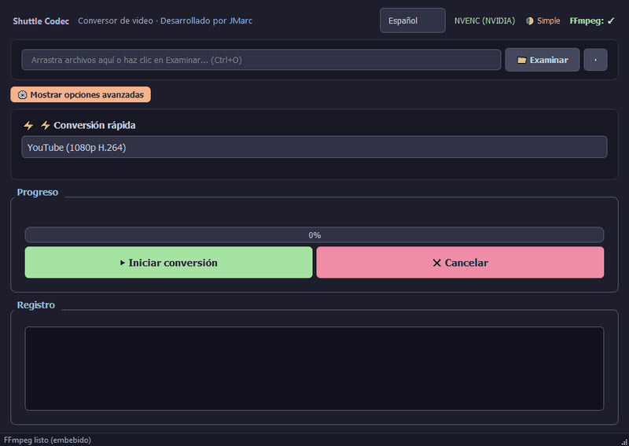

# Shuttle Codec

**Una GUI moderna, elegante y potente para FFmpeg** — Convierte videos sin escribir un solo comando.

<p align="center">
  
</p>

<p align="center">
  <a href="https://github.com/jmarc9901/shuttle-codec/blob/main/LICENSE">
    
  </a>
  <a href="https://www.python.org/downloads/">
    
  </a>
  <a href="https://github.com/jmarc9901/shuttle-codec/actions">
    
  </a>
  <a href="https://github.com/jmarc9901/shuttle-codec">
    
  </a>
  <a href="https://github.com/jmarc9901/shuttle-codec/releases">
    
  </a>
  <a href="https://github.com/jmarc9901/shuttle-codec/blob/main/CONTRIBUTING.md">
    
  </a>
</p>

<p align="center">
  <a href="README.md">🇬🇧 English</a>
</p>

> Convierte cualquier archivo de video con solo arrastrar y soltar. Soporta lote, aceleracion por hardware NVENC, recorte de video, conversion a GIF y modo experto. Tema oscuro estilo Catppuccin Mocha. Interfaz responsive adaptable a cualquier tamano de pantalla.

---

## Demo

<p align="center">
  
</p>

---

## Caracteristicas principales

### Faciles de usar
- **Modo Simple/Experto**: Por defecto modo simple (solo formato), toggle para opciones avanzadas
- **Arrastra y suelta**: Soporta multiples archivos a la vez
- **Atajos de teclado**: Ctrl+O (abrir), Ctrl+E (convertir), Ctrl+Q (salir), Delete (quitar)
- **Deteccion automatica**: Al cargar un video analiza codec, resolucion y sugiere la configuracion optima
- **Panel de informacion**: Codecs, resolucion, tamano y duracion visibles siempre al cargar un archivo
- **Responsive**: La interfaz se adapta a cualquier tamano de ventana con scroll automatico
- **🌐 Internacionalizacion**: Interfaz en Español e Ingles, seleccionable desde la cabecera

### Potentes
- **Conversion de video**: MP4 (H.264/H.265), MKV, AVI, MOV, WebM, **GIF**
- **Conversion de audio**: MP3, AAC, WAV, FLAC, OGG, M4A, WMA (archivos solo de audio)
- **Procesamiento por lotes**: Convierte multiples archivos con la misma configuracion
- **Conversion a GIF**: Genera GIFs optimizados con palette optimizada (palettegen + paletteuse)
- **Recorte de video**: Selecciona inicio y fin para recortar segmentos especificos (duracion en tiempo real)
- **Aceleracion por hardware**: Detecta automaticamente NVENC (NVIDIA), AMF (AMD) o QSV (Intel)
- **Control fino**: CRF, preset de codificacion, resolucion, FPS, codec de audio y mas

### Informativas
- **ETA y velocidad**: Tiempo restante estimado y velocidad durante la conversion
- **Info del archivo**: Codecs, resolucion, bitrate, duracion al cargar
- **Persistencia**: Recuerda tamano/posicion de ventana, idioma y ultimas configuraciones
- **Log detallado**: Registro completo de todas las operaciones

---

## Tecnologias

| Capa | Tecnologia |
|------|-----------|
| Lenguaje | Python 3.10+ |
| GUI | PyQt5 |
| Motor de video | FFmpeg (embebido) |
| Empaquetado | PyInstaller |
| Tema | Catppuccin Mocha |
| Testing | pytest + unittest.mock |

---

## Inicio rapido

### Opcion 1: Descargar (Recomendado)
1. Ve a la [ultima version](https://github.com/jmarc9901/shuttle-codec/releases/latest)
2. Descarga `shuttle-codec.exe`
3. Ejecutalo — FFmpeg ya viene incluido

### Opcion 2: Desde codigo fuente

```bash
# Clonar repositorio
git clone https://github.com/jmarc9901/shuttle-codec.git
cd shuttle-codec

# Instalar dependencias
pip install -r requirements.txt

# Descargar FFmpeg (solo primera vez)
python download_ffmpeg.py

# Ejecutar
python -m src.main
```

### Compilar ejecutable

```bash
python download_ffmpeg.py
pip install -e ".[build]"   # pyinstaller + pillow
python build.py
```

El ejecutable estara en `dist/shuttle-codec.exe`.

---

## Novedades de la v1.2.0

### 🐛 Correccion
- **WebM arreglado**: WebM solo acepta Opus/Vorbis, asi que el audio ahora
  se recodifica a Opus en vez de generar un stream AAC imposible de escribir
  (`Could not write header`). Tampoco se hace stream-copy hacia WebM.
- **Aceleracion HEVC arreglada**: MP4 (H.265) ahora usa `hevc_nvenc` /
  `hevc_amf` / `hevc_qsv` en lugar de caer silenciosamente al encoder H.264.
- **VP9 a calidad constante**: se agrega el obligatorio `-b:v 0` y se reemplaza
  el `-preset` no soportado por `-deadline`/`-cpu-used` de libvpx.
- **Filtro GIF limpio**: se elimina el `scale=-1:-1` invalido al mantener la
  resolucion original.
- **HEVC en MP4/MOV** se etiqueta `hvc1` para compatibilidad con QuickTime/Apple.

### 🔒 Seguridad
- Extraccion segura de tar/zip al descargar FFmpeg (mitiga path traversal,
  CVE-2007-4559) y `filter="data"` en Python 3.12+.
- SSL verification, validacion de rutas con `os.path.realpath()` y validacion
  de archivos multimedia antes de procesar.

### 🎯 Calidad
- `ruff` y `mypy` pasan limpios en todo el arbol (el CI verifica ambos).
- 110 tests unitarios, con tests de regresion para cada arreglo anterior y
  un smoke test headless de la ventana principal.
- Tipado moderno PEP 604 (`str | None`) sobre base Python 3.10+.
- Renombrado el atributo `thread` del worker de lote (ocultaba `QObject.thread()`).

### 🌐 Internacionalizacion y UX
- Interfaz Español/Ingles con cambio de idioma instantaneo y persistente.
- El indicador de estado de FFmpeg y la etiqueta de aceleracion por hardware
  se vuelven a renderizar correctamente al cambiar de idioma.

---

## Desarrollo

```bash
pip install -e ".[dev]"

python -m pytest tests/ -v     # 110 tests unitarios
ruff check .                   # lint
mypy src/                      # chequeo de tipos
```

---

## Estructura del proyecto

```
shuttle-codec/
├── src/
│   ├── __init__.py
│   ├── main.py               # Punto de entrada
│   ├── app.py                # Ventana principal (PyQt5) + orquestacion
│   ├── workers.py            # Worker QThread + gestor de lote
│   ├── ffmpeg_handler.py     # Construccion/ejecucion de comandos FFmpeg
│   ├── ffmpeg_downloader.py  # Busqueda de binarios (embebidos vs sistema)
│   ├── presets.py            # Presets por caso de uso + mapa de resoluciones
│   ├── theme.py              # Paleta y stylesheet Catppuccin Mocha
│   ├── utils.py              # Icono y helpers de tiempo/tamano
│   └── i18n.py               # Traducciones ES/EN
├── tests/
│   ├── test_app_smoke.py        # UI headless (se omite sin Qt)
│   ├── test_ffmpeg_handler.py   # comandos, formatos, hardware, recorte, audio
│   ├── test_ffmpeg_downloader.py
│   ├── test_download_ffmpeg.py  # seguridad de extraccion de archivos
│   ├── test_workers.py          # gestor de lote
│   ├── test_presets.py
│   ├── test_theme.py
│   ├── test_utils.py
│   └── test_i18n.py
├── resources/bin/           # Binarios FFmpeg embebidos
├── download_ffmpeg.py       # Descarga FFmpeg desde GitHub
├── build.py                 # Build con PyInstaller
├── pyproject.toml
└── requirements.txt
```

---

## Licencia

Apache 2.0 — Con atribucion y proteccion de patentes.

---

<p align="center">
  <b>Shuttle Codec</b> — Hecho por <a href="https://github.com/jmarc9901">@jmarc9901</a>
</p>
