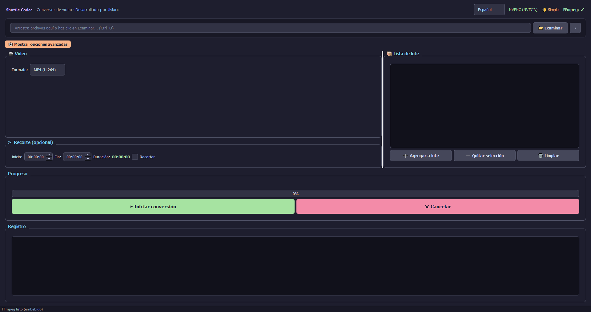

# Shuttle Codec

**A modern, elegant, and powerful GUI for FFmpeg** — Convert videos without writing a single command.

<p align="center">
  
</p>

<p align="center">
  <a href="https://github.com/jmarc9901/shuttle-codec/blob/main/LICENSE">
    
  </a>
  <a href="https://www.python.org/downloads/">
    
  </a>
  <a href="https://github.com/jmarc9901/shuttle-codec/actions">
    
  </a>
  <a href="https://github.com/jmarc9901/shuttle-codec">
    
  </a>
  <a href="https://github.com/jmarc9901/shuttle-codec/releases">
    
  </a>
  <a href="https://github.com/jmarc9901/shuttle-codec/blob/main/CONTRIBUTING.md">
    
  </a>
</p>

<p align="center">
  <a href="README.es.md">🇪🇸 Español</a>
</p>

> Drag & drop any video file to convert. Supports batch processing, NVENC hardware acceleration, video trimming, GIF conversion, and expert mode. Catppuccin Mocha dark theme. Responsive interface adapts to any screen size.

---

## Screenshots

<p align="center">
  
</p>

---

## Features

### User-Friendly
- **Simple/Expert Mode**: Simple mode by default (format only), toggle for advanced options
- **Drag & Drop**: Supports multiple files at once
- **Keyboard Shortcuts**: Ctrl+O (open), Ctrl+E (convert), Ctrl+Q (quit), Delete (remove)
- **Auto-detection**: Analyzes codec and resolution on file load, suggests optimal settings
- **Info Panel**: Codecs, resolution, size, and duration always visible
- **Responsive**: Adapts to any window size with automatic scrolling
- **🌐 Internationalization**: Spanish and English UI, switchable from the header

### Powerful
- **Video Conversion**: MP4 (H.264/H.265), MKV, AVI, MOV, WebM, **GIF**
- **Audio Conversion**: MP3, AAC, WAV, FLAC, OGG, M4A, WMA
- **Batch Processing**: Convert multiple files with the same settings
- **GIF Conversion**: Optimized GIFs with palette optimization (palettegen + paletteuse)
- **Video Trimming**: Select start and end points to cut specific segments
- **Hardware Acceleration**: Auto-detects NVENC (NVIDIA), AMF (AMD), or QSV (Intel)
- **Fine Control**: CRF, encoding preset, resolution, FPS, audio codec, and more

### Informative
- **ETA & Speed**: Estimated time remaining and speed during conversion
- **File Info**: Codecs, resolution, bitrate, duration on load
- **Persistence**: Remembers window size/position, language, and last settings
- **Detailed Log**: Complete record of all operations

---

## Quick Start

### Option 1: Download (Recommended)
1. Go to the [latest release](https://github.com/jmarc9901/shuttle-codec/releases/latest)
2. Download `shuttle-codec.exe`
3. Run it — FFmpeg is already included

### Option 2: Run from Source

```bash
# Clone
git clone https://github.com/jmarc9901/shuttle-codec.git
cd shuttle-codec

# Install dependencies
pip install -r requirements.txt

# Download FFmpeg (first time only)
python download_ffmpeg.py

# Run
python -m src.main
```

### Build Executable

```bash
python download_ffmpeg.py
pip install pyinstaller
python build.py
```

The executable will be at `dist/shuttle-codec.exe`.

---

## Tech Stack

| Layer | Technology |
|-------|-----------|
| Language | Python 3.11+ |
| GUI | PyQt5 |
| Video Engine | FFmpeg (bundled) |
| Packaging | PyInstaller |
| Theme | Catppuccin Mocha |
| Testing | pytest + unittest.mock |

---

## Recent Improvements (v1.1.0)

### 🔒 Security
- SSL verification enabled for FFmpeg download (removed `CERT_NONE`)
- Path validation with `os.path.realpath()` to prevent path traversal
- Media file validation (size, existence, type) before processing
- Safe subprocess handling with timeouts

### 🎯 Typing & Quality
- Type hints across all functions and methods
- Return type and parameter hints throughout the codebase
- Import reorganization and removal of unused imports

### 🌐 Internationalization
- Complete i18n system with Spanish/English support
- 100+ translated strings in both languages
- Language selector in the app header
- Language persistence between sessions

### 🧪 Testing
- 37 unit tests covering:
  - `ffmpeg_handler.py`: 22 tests (commands, formats, hardware, path resolution)
  - `ffmpeg_downloader.py`: 8 tests (binary search, bundled vs system)
  - `i18n.py`: 7 tests (translations, language switching, missing keys)
- Run with `python -m pytest tests/`

### 💡 UX/UI
- Descriptive tooltips on all controls
- File validation with clear error messages
- Properly handled empty states
- Language selector directly in the header

---

## Run Tests

```bash
pip install pytest
python -m pytest tests/ -v
```

---

## Project Structure

```
shuttle-codec/
├── src/
│   ├── __init__.py
│   ├── main.py              # Entry point
│   ├── app.py               # Main UI (PyQt5)
│   ├── ffmpeg_handler.py     # FFmpeg/FFprobe logic
│   ├── ffmpeg_downloader.py  # Binary location
│   └── i18n.py              # ES/EN translations
├── tests/
│   ├── test_i18n.py
│   ├── test_ffmpeg_handler.py
│   └── test_ffmpeg_downloader.py
├── resources/bin/           # Bundled FFmpeg binaries
├── download_ffmpeg.py       # FFmpeg downloader
├── build.py                 # PyInstaller builder
├── pyproject.toml
└── requirements.txt
```

---

## License

Apache 2.0 — With attribution and patent protection.

---

<p align="center">
  <b>Shuttle Codec</b> — Made by <a href="https://github.com/jmarc9901">@jmarc9901</a>
</p>
